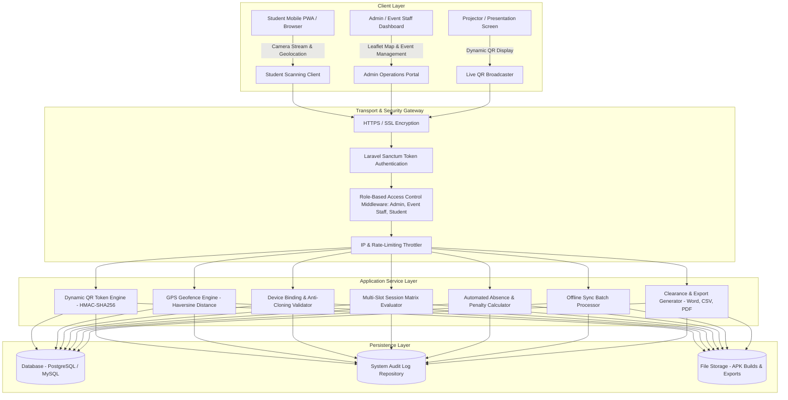
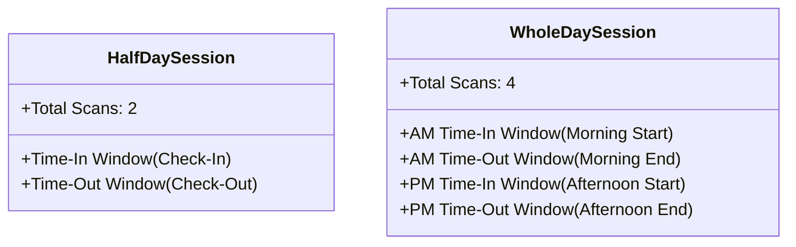
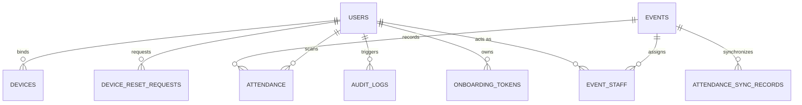

# TALIBON POLYTECHNIC COLLEGE
## Bachelor of Science in Information Systems (BSIS)
### Capstone Research Project — Technical System Manual & Appendices

---

# SECURE DYNAMIC QR ATTENDANCE SYSTEM WITH GPS GEOFENCING & DEVICE BINDING
## Technical Architecture, Data Dictionary, Cryptographic Specifications, & API Catalog

```
Project Identifier: TPC-BSIS-ATTENDANCE-V4
Target Institution: Talibon Polytechnic College (TPC)
Department        : Bachelor of Science in Information Systems (BSIS)
Technology Stack  : Laravel 11 PHP Backend (REST API), PostgreSQL / MySQL, Vanilla JS (ES6+),
                    Progressive Web Application (PWA), Leaflet GIS Engine, Web Audio API
```

---

## TABLE OF CONTENTS
1. [System Architecture & High-Level Design](#1-system-architecture--high-level-design)
2. [Core Algorithmic & Cryptographic Specifications](#2-core-algorithmic--cryptographic-specifications)
   - 2.1 [Dynamic QR Code Generation & HMAC-SHA256 Verification](#21-dynamic-qr-code-generation--hmac-sha256-verification)
   - 2.2 [GPS Geofence Validation (Haversine Formula)](#22-gps-geofence-validation-haversine-formula)
   - 2.3 [Single-Device Binding & Anti-Cloning Engine](#23-single-device-binding--anti-cloning-engine)
   - 2.4 [Multi-Slot Scanning Timeframe Matrix (Half-Day vs. Whole-Day)](#24-multi-slot-scanning-timeframe-matrix)
   - 2.5 [Automated Absence & Fine Processing Engine](#25-automated-absence--fine-processing-engine)
   - 2.6 [Offline Attendance Caching & Batch Synchronization Protocol](#26-offline-attendance-caching--batch-synchronization-protocol)
3. [Database Schema & Data Dictionary](#3-database-schema--data-dictionary)
4. [Complete RESTful API Endpoint Catalog](#4-complete-restful-api-endpoint-catalog)
5. [Security Architecture & Threat Mitigation Matrix](#5-security-architecture--threat-mitigation-matrix)
6. [Deployment, Environment Setup, & Installation Guide](#6-deployment-environment-setup--installation-guide)

---

# 1. SYSTEM ARCHITECTURE & HIGH-LEVEL DESIGN

The **Secure BSIS Attendance System** is architected using a decoupled **Client-Server Service-Oriented Architecture (SOA)** with a centralized RESTful API backend, a desktop-optimized administrative operations portal, and a lightweight mobile Progressive Web Application (PWA) for students.



---

# 2. CORE ALGORITHMIC & CRYPTOGRAPHIC SPECIFICATIONS

### 2.1 Dynamic QR Code Generation & HMAC-SHA256 Verification

To prevent **screenshot sharing, proxy attendance, and unauthorized remote distribution**, the attendance QR code is dynamic, rotating at a default interval of **60 seconds** (configurable from 5 to 300 seconds).

#### Mathematical & Token Specification:
Each dynamic QR token payload consists of:
$$\text{DataToSign} = \text{EventID} \parallel \text{Timestamp} \parallel \text{ExpiresAt} \parallel \text{Nonce}$$

The digital signature is generated via **HMAC-SHA256**:
$$\text{Signature} = \text{HMAC-SHA256}(\text{DataToSign}, \text{SecretKey})$$

Where:
* $\text{EventID}$: Integer ID of the active event.
* $\text{Timestamp}$: UNIX epoch timestamp at time of token generation.
* $\text{ExpiresAt}$: $\text{Timestamp} + \text{DurationSeconds}$ (e.g., $+60\text{s}$).
* $\text{Nonce}$: Cryptographically secure 16-character pseudo-random string (`Str::random(16)`).
* $\text{SecretKey}$: Server application key (`config('app.key')`).

```json
{
  "event_id": 5,
  "timestamp": 1756112400,
  "expires_at": 1756112460,
  "nonce": "k9L3mPx7Qv2w8RtY",
  "sig": "e3b0c44298fc1c149afbf4c8996fb92427ae41e4649b934ca495991b7852b855"
}
```
The JSON structure is converted to URL-safe Base64 and rendered as an interactive QR Matrix.

#### Verification Algorithm:
1. Decode base64 payload and extract components.
2. Recompute expected signature using server secret key.
3. Verify signature using constant-time string comparison (`hash_equals`) to protect against timing attacks.
4. Check current time against expiration with a strict **5-second network tolerance / clock-drift grace period**:
   $$\text{CurrentTime} \le \text{ExpiresAt} + 5$$

---

### 2.2 GPS Geofence Validation (Haversine Formula)

The system ensures that students are physically present at the accredited venue by measuring spherical geodesic distance using the **Haversine Formula**:

$$a = \sin^2\left(\frac{\Delta \phi}{2}\right) + \cos(\phi_1) \cdot \cos(\phi_2) \cdot \sin^2\left(\frac{\Delta \lambda}{2}\right)$$
$$c = 2 \cdot \operatorname{atan2}\left(\sqrt{a}, \sqrt{1-a}\right)$$
$$d = R \cdot c$$

Where:
* $\phi_1, \phi_2$: Latitude of Student and Venue in Radians.
* $\Delta \phi = \phi_2 - \phi_1$: Latitude difference.
* $\Delta \lambda = \lambda_2 - \lambda_1$: Longitude difference.
* $R = 6,371,000\text{ meters}$: Mean radius of the Earth.
* $d$: Calculated straight-line distance in meters.

#### Validation Rule:
$$\text{Status} = \begin{cases} \text{VALID}, & \text{if } d \le \text{AllowedRadius} \\ \text{REJECTED (Geofence Breach)}, & \text{if } d > \text{AllowedRadius} \end{cases}$$

---

### 2.3 Single-Device Binding & Anti-Cloning Engine

To eradicate "buddy punching" (one student logging into another student's account), student accounts are locked to a single physical mobile device:

1. **Initial Device Binding:** Upon first login or onboarding, the client device generates a unique device identifier stored in persistent local storage. The backend stores this credential in the `devices` table with status `active`.
2. **Device Verification:** Every scan request must supply the bound `device_credential`. The backend verifies matching credentials using `hash_equals()`.
3. **Anti-App Duplication & Cloning Defense:** If two different students attempt to submit scans from the identical physical device credential, the second account is blocked with an unauthorized collision alert.
4. **Lockdown & Reset Procedure:** If 3 consecutive device mismatch attempts occur, the account is temporarily suspended. Re-binding requires submitting an official **Device Reset Request** subject to Administrator approval.

---

### 2.4 Multi-Slot Scanning Timeframe Matrix

The system dynamically adapts to two institutional scheduling formats:



* **Grace Period Configuration:** Events support configurable scan windows (e.g. 30 minutes before and after scheduled slot boundaries).
* **Emergency Window Bypass Mode:** Authorized administrators or event staff can toggle a timed Emergency Bypass (15, 20, 30, or 60 minutes) protected by password authentication and a 2-activation quota per event.

---

### 2.5 Automated Absence & Fine Processing Engine

When an event session is marked **Completed** (requiring password authorization from the administrator/staff):
1. The engine queries all active students matching the event's target year levels (e.g., $1^{\text{st}}, 2^{\text{nd}}, 3^{\text{rd}}, 4^{\text{th}}$ Year, or All).
2. Students with **zero recorded scans** are automatically assigned an `absent` record with total fines calculated based on missed slots:
   $$\text{Total Absent Fine} = \text{Missed Slots Count} \times \text{Fine Per Slot}$$
3. Students with partial attendance (e.g., completed Time-In but missed Time-Out) have individual missed slot penalties assessed automatically.
4. Fines can be settled as `PAID` or officially `WAIVED` with recorded justification.

---

### 2.6 Offline Attendance Caching & Batch Synchronization Protocol

During network outages or remote campus venues without cellular coverage:
1. The student PWA client buffers scan transactions in indexed local storage (`offline_scans_queue`).
2. When connectivity is restored, the client transmits the array of offline records to `/api/sync/attendance`.
3. The server processes records inside a database transaction, validates timestamps against event session windows, flags the record with `is_offline_sync = true`, and returns a detailed sync receipt.

---

# 3. DATABASE SCHEMA & DATA DICTIONARY

The relational database architecture consists of 10 primary tables designed with strict integrity constraints, indexing, and cascade rules.



### Table 1: `users`
Stores student, event staff, and administrator account credentials and academic profiles.

| Column | Data Type | Constraints | Description |
| :--- | :--- | :--- | :--- |
| `id` | `BIGINT UNSIGNED` | Primary Key, Auto Increment | Unique internal identifier |
| `uuid` | `CHAR(36)` | Unique, Indexed | Universally unique public identifier |
| `student_number` | `VARCHAR(50)` | Nullable, Unique, Indexed | Official institutional student ID number |
| `first_name` | `VARCHAR(100)` | Not Null | Given name |
| `middle_name` | `VARCHAR(100)` | Nullable | Middle name or initial |
| `last_name` | `VARCHAR(100)` | Not Null | Family / Surname |
| `email` | `VARCHAR(150)` | Unique, Indexed | Institutional email (`@tpc.edu.ph`) |
| `password` | `VARCHAR(255)` | Not Null | Bcrypt/Argon2 one-way hashed password |
| `role` | `ENUM` | Not Null, Default: `'student'` | `'admin'`, `'event_staff'`, `'student'` |
| `year_level` | `ENUM` | Nullable | `'1st Year'`, `'2nd Year'`, `'3rd Year'`, `'4th Year'` |
| `section_block`| `VARCHAR(50)` | Nullable | Academic section (e.g. `'BSIS 4-A'`) |
| `status` | `ENUM` | Not Null, Default: `'pending'` | `'pending'`, `'active'`, `'suspended'`, `'blocked'` |
| `email_verified_at` | `TIMESTAMP` | Nullable | Timestamp of email verification |
| `created_at` / `updated_at` | `TIMESTAMP` | Default: Current Timestamp | System audit timestamps |

---

### Table 2: `events`
Stores campus event configurations, geographic coordinates, scanning windows, and fine parameters.

| Column | Data Type | Constraints | Description |
| :--- | :--- | :--- | :--- |
| `id` | `BIGINT UNSIGNED` | Primary Key, Auto Increment | Unique event identifier |
| `uuid` | `CHAR(36)` | Unique, Indexed | Public UUID for external referencing |
| `title` | `VARCHAR(255)` | Not Null | Name of the event / seminar / activity |
| `description` | `TEXT` | Nullable | Comprehensive details and objectives |
| `session_type` | `ENUM` | Not Null, Default: `'half_day'` | `'half_day'` (2 scans) or `'whole_day'` (4 scans) |
| `start_time` | `DATETIME` | Not Null, Indexed | Official event start schedule |
| `end_time` | `DATETIME` | Not Null | Official event conclusion schedule |
| `checkin_start_time` / `end` | `DATETIME` | Nullable | Half-day Time-In scan timeframe |
| `checkout_start_time` / `end`| `DATETIME` | Nullable | Half-day Time-Out scan timeframe |
| `am_checkin_start_time` / `end` | `DATETIME` | Nullable | Whole-day AM Time-In scan timeframe |
| `am_checkout_start_time` / `end` | `DATETIME` | Nullable | Whole-day AM Time-Out scan timeframe |
| `pm_checkin_start_time` / `end` | `DATETIME` | Nullable | Whole-day PM Time-In scan timeframe |
| `pm_checkout_start_time` / `end` | `DATETIME` | Nullable | Whole-day PM Time-Out scan timeframe |
| `allow_window_bypass` | `BOOLEAN` | Default: `FALSE` | Emergency bypass status flag |
| `bypass_expires_at` | `DATETIME` | Nullable | Emergency bypass expiration timer |
| `bypass_count` | `INT` | Default: `0` | Quota tracker (Max 2 staff activations) |
| `target_year_levels` | `JSON` | Nullable | Target audience (e.g. `["1st Year", "4th Year"]`) |
| `venue_name` | `VARCHAR(255)` | Not Null | Name of accredited facility (e.g. TPC Gymnasium) |
| `venue_latitude` | `DECIMAL(10, 8)` | Not Null | Venue latitude GPS coordinate |
| `venue_longitude` | `DECIMAL(11, 8)` | Not Null | Venue longitude GPS coordinate |
| `allowed_radius_meters` | `DECIMAL(8, 2)` | Default: `50.00` | Allowed geofence boundary in meters |
| `fine_amount` | `DECIMAL(8, 2)` | Default: `0.00` | Total fine amount for full absence |
| `fine_per_slot` | `DECIMAL(8, 2)` | Nullable | Fine amount assessed per missed scan slot |
| `status` | `ENUM` | Default: `'upcoming'` | `'upcoming'`, `'active'`, `'completed'`, `'cancelled'` |
| `created_by` | `BIGINT UNSIGNED` | Foreign Key -> `users.id` | Administrator or staff creator ID |

---

### Table 3: `attendance`
Stores student attendance logs, timestamps, verification telemetry, and assessed penalties.

| Column | Data Type | Constraints | Description |
| :--- | :--- | :--- | :--- |
| `id` | `BIGINT UNSIGNED` | Primary Key, Auto Increment | Unique attendance record ID |
| `event_id` | `BIGINT UNSIGNED` | Foreign Key -> `events.id`, Cascades | Referenced event ID |
| `user_id` | `BIGINT UNSIGNED` | Foreign Key -> `users.id`, Cascades | Referenced student user ID |
| `scan_time` | `TIMESTAMP` | Nullable, Indexed | Timestamp of primary check-in scan |
| `checkout_time` | `TIMESTAMP` | Nullable | Timestamp of primary check-out scan |
| `am_time_in` / `am_time_out` | `TIMESTAMP` | Nullable | Morning slot timestamps (Whole-day) |
| `pm_time_in` / `pm_time_out` | `TIMESTAMP` | Nullable | Afternoon slot timestamps (Whole-day) |
| `status` | `ENUM` | Default: `'present'` | `'present'`, `'late'`, `'absent'`, `'manual_override'` |
| `slot_statuses` | `JSON` | Nullable | Status per slot (`{"am_in":"present","am_out":"missed"}`) |
| `fine_amount` | `DECIMAL(8, 2)` | Default: `0.00`, Indexed | Incurred penalty fine balance in PHP |
| `fine_paid` | `BOOLEAN` | Default: `FALSE`, Indexed | Settle status flag (`TRUE` = Cleared / Paid) |
| `latitude` | `DECIMAL(10, 8)` | Nullable | GPS latitude at time of scan |
| `longitude` | `DECIMAL(11, 8)` | Nullable | GPS longitude at time of scan |
| `distance_meters` | `DECIMAL(8, 2)` | Nullable | Calculated Haversine distance from venue |
| `device_credential` | `VARCHAR(255)` | Nullable | Transmitted device fingerprint |
| `is_offline_sync` | `BOOLEAN` | Default: `FALSE` | Offline capture indicator |
| `override_by` | `BIGINT UNSIGNED` | Nullable, Foreign Key -> `users.id` | Staff user ID who performed manual override |
| `override_reason` | `TEXT` | Nullable | Justification note for manual override |
| `verification_data` | `JSON` | Nullable | Payment receipt, waiver logs, and security metadata |

---

### Table 4: `devices`
Tracks single-device hardware bindings and security status.

| Column | Data Type | Constraints | Description |
| :--- | :--- | :--- | :--- |
| `id` | `BIGINT UNSIGNED` | Primary Key, Auto Increment | Unique device ID |
| `user_id` | `BIGINT UNSIGNED` | Foreign Key -> `users.id`, Cascades | Bound student user ID |
| `device_credential` | `VARCHAR(255)` | Not Null, Indexed | Cryptographic UUID bound to device storage |
| `device_name` | `VARCHAR(150)` | Nullable | Human-readable device model |
| `user_agent` | `TEXT` | Nullable | Client browser and OS signature |
| `ip_address` | `VARCHAR(45)` | Nullable | Client IP address at binding time |
| `status` | `ENUM` | Default: `'active'` | `'active'`, `'pending_reset'`, `'inactive'`, `'blocked'` |
| `bound_at` | `TIMESTAMP` | Default: Current Timestamp | Date/time when device was registered |

---

### Table 5: `device_reset_requests`
Manages formal student appeals to unbind a lost, damaged, or upgraded phone.

| Column | Data Type | Constraints | Description |
| :--- | :--- | :--- | :--- |
| `id` | `BIGINT UNSIGNED` | Primary Key, Auto Increment | Unique request ID |
| `user_id` | `BIGINT UNSIGNED` | Foreign Key -> `users.id` | Requesting student |
| `device_id` | `BIGINT UNSIGNED` | Nullable, Foreign Key -> `devices.id` | Previously registered device |
| `reason` | `TEXT` | Not Null | Student's explanation for reset |
| `status` | `ENUM` | Default: `'pending'` | `'pending'`, `'approved'`, `'rejected'` |
| `reviewed_by` | `BIGINT UNSIGNED` | Nullable, Foreign Key -> `users.id` | Reviewing administrator ID |
| `reviewed_at` | `TIMESTAMP` | Nullable | Review timestamp |
| `rejection_reason` | `TEXT` | Nullable | Administrative remarks if rejected |

---

### Table 6: `audit_logs`
Provides an immutable security trail for institutional compliance.

| Column | Data Type | Constraints | Description |
| :--- | :--- | :--- | :--- |
| `id` | `BIGINT UNSIGNED` | Primary Key, Auto Increment | Unique audit record ID |
| `user_id` | `BIGINT UNSIGNED` | Nullable, Foreign Key -> `users.id` | Actor who performed the action |
| `action` | `VARCHAR(100)` | Not Null, Indexed | Action identifier (e.g. `'fine_paid'`) |
| `description` | `TEXT` | Not Null | Detailed human-readable log entry |
| `ip_address` | `VARCHAR(45)` | Nullable | Source IP address |
| `user_agent` | `TEXT` | Nullable | Client software user agent string |
| `metadata` | `JSON` | Nullable | Diagnostic state and contextual payload |
| `created_at` | `TIMESTAMP` | Default: Current Timestamp | Timestamp of event |

---

### Table 7: `system_settings`
Key-value configuration store for system-wide behavioral parameters.

| Column | Data Type | Constraints | Description |
| :--- | :--- | :--- | :--- |
| `id` | `BIGINT UNSIGNED` | Primary Key, Auto Increment | Unique setting ID |
| `key` | `VARCHAR(100)` | Unique, Indexed | Configuration key (e.g. `qr_expiration_seconds`) |
| `value` | `TEXT` | Nullable | Configuration value (e.g. `60`) |
| `description` | `VARCHAR(255)` | Nullable | Description of setting impact |

---

# 4. COMPLETE RESTFUL API ENDPOINT CATALOG

All protected endpoints require the HTTP header:
`Authorization: Bearer <Sanctum_Token>`

| Method | Endpoint Route | Middleware / Access | Description |
| :--- | :--- | :--- | :--- |
| **POST** | `/api/auth/login` | Public (Rate-Limited 3/min) | Authenticates student, staff, or admin; returns token. |
| **POST** | `/api/auth/logout` | `auth:sanctum` | Revokes the current API session token. |
| **GET** | `/api/auth/me` | `auth:sanctum` | Retrieves authenticated user profile and bound device. |
| **POST** | `/api/auth/forgot-password` | Public | Dispatches secure password reset link via institutional email. |
| **POST** | `/api/auth/reset-password` | Public | Verifies reset token and updates account password. |
| **GET** | `/api/onboarding/{token}` | Public | Validates student onboarding token and displays name. |
| **POST** | `/api/onboarding/{token}/complete`| Public | Sets password and activates student account. |
| **GET** | `/api/settings` | `auth:sanctum` | Returns global system settings and QR interval. |
| **POST** | `/api/settings` | `role:admin` | Updates QR interval (5–300s) and system parameters. |
| **GET** | `/api/events` | `auth:sanctum` | Lists events (Upcoming soonest first; Completed at bottom). |
| **GET** | `/api/events/{id}` | `auth:sanctum` | Returns event details, coordinates, and scan stats. |
| **POST** | `/api/events` | `role:admin` | Creates a new event with geofence and timeframe rules. |
| **PUT** | `/api/events/{id}` | `role:admin,event_staff` | Updates event schedule, venue, radius, or status. |
| **DELETE**| `/api/events/{id}` | `role:admin` | Permanently removes event (Password-verified). |
| **POST** | `/api/events/batch-delete` | `role:admin` | Deletes multiple selected events (Password-verified). |
| **POST** | `/api/events/{id}/activate` | `role:admin,event_staff` | Transitions event to active live scanning mode. |
| **POST** | `/api/events/{id}/complete` | `role:admin,event_staff` | Finalizes event and auto-calculates absence fines. |
| **POST** | `/api/events/{id}/process-absences`| `role:admin,event_staff` | Manually recalculates absence penalty records. |
| **POST** | `/api/events/{id}/toggle-bypass` | `role:admin,event_staff` | Enables timed emergency bypass (Password-verified). |
| **POST** | `/api/events/{event}/qr-token` | `role:admin,event_staff` | Generates dynamic signed 60-second QR token. |
| **POST** | `/api/attendance/scan` | `auth:sanctum` | Validates QR token signature, GPS geofence, and device. |
| **POST** | `/api/attendance/override` | `role:admin,event_staff` | Records staff manual attendance override. |
| **GET** | `/api/attendance` | `auth:sanctum` | Retrieves attendance history. |
| **POST** | `/api/sync/attendance` | `role:admin,event_staff` | Synchronizes batch of offline scans. |
| **GET** | `/api/fines` | `auth:sanctum` | Lists fines and balances across all students. |
| **POST** | `/api/fines/{id}/pay` | `role:admin,event_staff` | Marks student fine as PAID. |
| **POST** | `/api/fines/{id}/waive` | `role:admin,event_staff` | Waives/forgives student fine with justification. |
| **POST** | `/api/fines/batch-pay` | `role:admin,event_staff` | Batch settles multiple selected fines. |
| **POST** | `/api/fines/batch-waive` | `role:admin,event_staff` | Batch waives multiple selected fines. |
| **GET** | `/api/reports/attendance` | `role:admin,event_staff` | Attendance roster report with student filters. |
| **GET** | `/api/reports/fines` | `role:admin,event_staff` | Detailed clearance fine report. |
| **GET** | `/api/reports/export` | `role:admin,event_staff` | Exports masterlist in Word (.docx) or CSV format. |
| **POST** | `/api/students` | `role:admin` | Provisions a single new student account. |
| **POST** | `/api/students/import` | `role:admin` | Batch provisions students from CSV spreadsheet. |
| **GET** | `/api/users` | `role:admin` | User management masterlist. |
| **PUT** | `/api/users/{id}` | `role:admin` | Updates user profile and credentials. |
| **POST** | `/api/users/{id}/reset-device` | `role:admin` | Unbinds student device directly. |
| **DELETE**| `/api/users/{id}` | `role:admin` | Deletes user account. |
| **GET** | `/api/device-resets` | `role:admin` | Lists student device reset appeals. |
| **POST** | `/api/device-resets/{id}/approve`| `role:admin` | Approves device reset and unbinds hardware. |
| **POST** | `/api/device-resets/{id}/reject` | `role:admin` | Rejects device reset appeal. |
| **GET** | `/api/audit-logs` | `role:admin` | Retrieves searchable system audit log feed. |

---

# 5. SECURITY ARCHITECTURE & THREAT MITIGATION MATRIX

| Attack Vector / Security Threat | Severity | Technical Defense Mechanism | System Implementation |
| :--- | :---: | :--- | :--- |
| **QR Screenshot Sharing / Proxying** | High | Dynamic Rotating Tokens with Cryptographic Signature | Tokens expire in **60 seconds**; signed with HMAC-SHA256 and unique nonce. Expired or forwarded QR screenshots fail signature check. |
| **Off-Site Scanning / Geofence Spoofing** | High | Server-Side Haversine Radius Enforcement | GPS coordinates validated on server; coordinates must fall within allowed venue radius (e.g. 50 meters). |
| **Buddy Punching (Multiple Logins on 1 Phone)** | High | Single-Device Hardware Binding & Anti-Cloning Check | Accounts bound to a single device credential. Attempting to log into a classmate's account on the same device triggers an anti-cloning block. |
| **Privilege Escalation** | Critical | Role-Based Access Control (RBAC) Route Guards | Sensitive operations (`qr-token`, `activate`, `complete`, `bypass`, `override`, `fines`) strictly protected by `role:admin,event_staff` middleware. |
| **Brute-Force Authentication Attacks** | Medium | Throttling & Rate-Limiter Defense | Login attempts restricted to **3 failed attempts per minute** before applying a 60-second cooldown lock. |
| **SQL Injection (SQLi)** | Critical | Parameterized Queries & ORM Data Access | 100% of database interactions execute through Eloquent ORM with PDO prepared statements. |
| **Unauthorized Event Completion / Bypass** | High | Administrative Password Re-Authentication | Critical state changes require the administrator or staff to enter their account password to confirm. |
| **Data Tampering & Accountability Loss** | Medium | Immutable Centralized Audit Logging | Every administrative action, fine settlement, override, and login attempt logs actor ID, timestamp, IP, and User-Agent. |

---

# 6. DEPLOYMENT, ENVIRONMENT SETUP, & INSTALLATION GUIDE

### 6.1 Server Requirements
* **PHP:** $\ge 8.2$ with `pdo`, `mbstring`, `openssl`, `tokenizer`, `xml`, `ctype`, `json`, `curl`, `zip` extensions enabled.
* **Database:** PostgreSQL $\ge 14$ or MySQL $\ge 8.0$.
* **Web Server:** Nginx or Apache with URL rewriting enabled.
* **HTTPS/SSL:** Mandatory for HTML5 Camera MediaStream API and Geolocation API.

### 6.2 Environment Configuration (`.env`)
```env
APP_NAME="TPC BSIS Attendance System"
APP_ENV=production
APP_KEY=base64:... (Generated via php artisan key:generate)
APP_DEBUG=false
APP_URL=https://tpc-bsis.online

DB_CONNECTION=pgsql
DB_HOST=127.0.0.1
DB_PORT=5432
DB_DATABASE=tpc_attendance
DB_USERNAME=postgres
DB_PASSWORD=your_secure_password

MAIL_MAILER=smtp
MAIL_HOST=smtp.gmail.com
MAIL_PORT=587
MAIL_USERNAME=your_department_email@gmail.com
MAIL_PASSWORD=your_app_password
MAIL_ENCRYPTION=tls
MAIL_FROM_ADDRESS="bsis@tpc.edu.ph"
MAIL_FROM_NAME="TPC BSIS Attendance System"
```

### 6.3 Installation Commands
```bash
# 1. Clone repository
git clone https://github.com/hackjas1/team_grapes.git
cd team_grapes

# 2. Install backend dependencies
composer install --no-dev --optimize-autoloader

# 3. Setup environment configuration
cp .env.example .env
php artisan key:generate

# 4. Execute database migrations and seed initial data
php artisan migrate --force
php artisan db:seed --force

# 5. Optimize framework cache
php artisan config:cache
php artisan route:cache
php artisan view:cache
```
