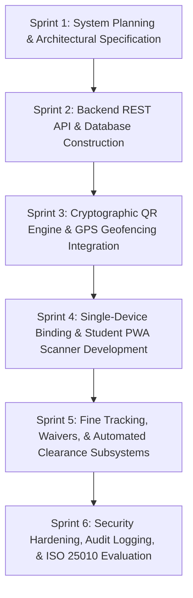
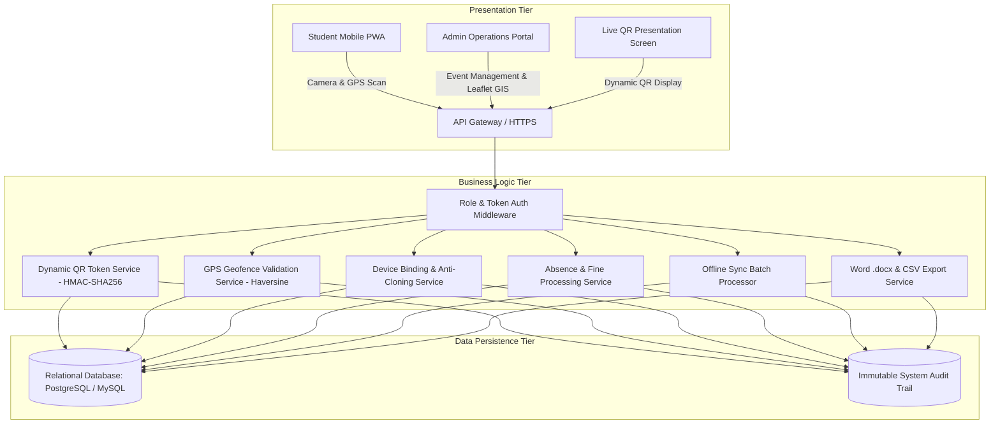
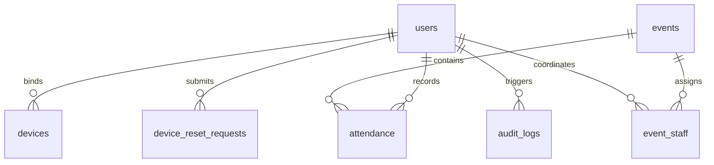

# TALIBON POLYTECHNIC COLLEGE
## San Jose, Talibon, Bohol
### Department of Information Technology & Information Systems
#### Bachelor of Science in Information Systems (BSIS)

---

# SECURE DYNAMIC QR CODE-BASED ATTENDANCE MONITORING SYSTEM WITH GPS VERIFICATION AND DEVICE BINDING FOR COLLEGE EVENTS AT TALIBON POLYTECHNIC COLLEGE

### A Capstone Research Project Proposal (Chapters 1, 2, and 3)
Presented to the Faculty of the Department of Information Technology and Information Systems
Talibon Polytechnic College, Talibon, Bohol

In Partial Fulfillment of the Requirements for the Degree
**Bachelor of Science in Information Systems (BSIS)**

---

## TABLE OF CONTENTS
- [CHAPTER 1: THE PROBLEM AND ITS BACKGROUND](#chapter-1-the-problem-and-its-background)
  - [1.1 Introduction](#11-introduction)
  - [1.2 Background of the Study](#12-background-of-the-study)
  - [1.3 Statement of the Problem](#13-statement-of-the-problem)
  - [1.4 Objectives of the Study](#14-objectives-of-the-study)
    - [1.4.1 General Objective](#141-general-objective)
    - [1.4.2 Specific Objectives](#142-specific-objectives)
  - [1.5 Significance of the Study](#15-significance-of-the-study)
  - [1.6 Scope and Delimitations](#16-scope-and-delimitations)
  - [1.7 Definition of Terms](#17-definition-of-terms)
- [CHAPTER 2: REVIEW OF RELATED LITERATURE AND STUDIES](#chapter-2-review-of-related-literature-and-studies)
  - [2.1 Related Literature (Foreign and Local)](#21-related-literature-foreign-and-local)
  - [2.2 Related Studies (Foreign and Local)](#22-related-studies-foreign-and-local)
  - [2.3 Comparative Analysis of Existing Attendance Systems](#23-comparative-analysis-of-existing-attendance-systems)
  - [2.4 Conceptual / Theoretical Framework (IPO Model)](#24-conceptual--theoretical-framework-ipo-model)
  - [2.5 Synthesis](#25-synthesis)
- [CHAPTER 3: METHODOLOGY](#chapter-3-methodology)
  - [3.1 Software Development Methodology (Agile Scrum)](#31-software-development-methodology-agile-scrum)
  - [3.2 System Requirements Analysis](#32-system-requirements-analysis)
    - [3.2.1 Functional Requirements](#321-functional-requirements)
    - [3.2.2 Non-Functional Requirements](#322-non-functional-requirements)
  - [3.3 System Architecture and High-Level Design](#33-system-architecture-and-high-level-design)
  - [3.4 Mathematical and Cryptographic Specifications](#34-mathematical-and-cryptographic-specifications)
    - [3.4.1 Dynamic QR Cryptographic Signing (HMAC-SHA256)](#341-dynamic-qr-cryptographic-signing-hmac-sha256)
    - [3.4.2 GPS Geofence Geodesic Distance (Haversine Formula)](#342-gps-geofence-geodesic-distance-haversine-formula)
    - [3.4.3 Single-Device Hardware Binding & Anti-Cloning Engine](#343-single-device-hardware-binding--anti-cloning-engine)
    - [3.4.4 Multi-Slot Timeframe Matrix & Absence Calculation](#344-multi-slot-timeframe-matrix--absence-calculation)
  - [3.5 Database Design and Data Dictionary](#35-database-design-and-data-dictionary)
  - [3.6 Hardware and Software Specifications](#36-hardware-and-software-specifications)
  - [3.7 Research Instrument and Evaluation Plan (ISO/IEC 25010)](#37-research-instrument-and-evaluation-plan-isoiec-25010)

---

# CHAPTER 1: THE PROBLEM AND ITS BACKGROUND

## 1.1 Introduction
In higher education institutions, student participation in co-curricular, extra-curricular, and departmental assemblies is an integral component of student development, institutional governance, and community engagement. At Talibon Polytechnic College (TPC), particularly within the Bachelor of Science in Information Systems (BSIS) department, attendance at official college events—such as general student assemblies, academic symposia, IT summits, sports activities, and institutional convocations—is systematically monitored. Accurate attendance monitoring ensures student engagement, validates institutional clearance requirements, and forms the basis for assessing departmental student organization fines and clearances.

Despite rapid advancements in mobile and web computing, many collegiate institutions continue to rely on traditional, manual attendance mechanisms such as paper-based logbooks, physical signature rosters, and static printed sign-in sheets. These manual workflows are notoriously vulnerable to administrative inefficiencies, long queue congestion during venue entry and dismissal, illegible signatures, lost or damaged paper rosters, and fraudulent practices—most notably "proxy attendance" or "buddy punching" (where a student logs in or signs on behalf of an absent peer).

Furthermore, the manual aggregation of attendance sheets to calculate fines and process semester-end student clearances is labor-intensive and error-prone for student treasurers and departmental officers. To resolve these operational challenges, this study designs, develops, and implements the **Secure Dynamic QR Code-Based Attendance Monitoring System with GPS Verification and Device Binding for College Events at Talibon Polytechnic College**. By combining cryptographic rotating QR codes, spherical GPS geofencing, single-device hardware binding, and automated fine calculation engines, the system provides a robust, tamper-resistant, and efficient attendance management framework.

---

## 1.2 Background of the Study
Talibon Polytechnic College, located in San Jose, Talibon, Bohol, is a premier local higher education institution serving thousands of students across multiple collegiate degree programs, including the Bachelor of Science in Information Systems. Throughout each academic semester, the BSIS Department and its student organization organize various mandatory and elective departmental events held across diverse campus venues such as the TPC Gymnasium, Audio-Visual Center, Multi-Purpose Hall, and IT Computer Laboratories.

Historically, attendance at these assemblies has been tracked through paper sign-in sheets managed by student officers stationed at venue entrances. An in-depth institutional review revealed multiple critical deficiencies in this traditional setup:
1. **Severe Entry and Dismissal Congestion:** With student cohorts exceeding hundreds of attendees, manual signing creates long queues, delaying event commencement and causing crowd congestion.
2. **Proxy Signing ("Buddy Punching"):** Students routinely sign the names and student numbers of absent classmates, compromising attendance integrity.
3. **Data Loss and Inaccurate Records:** Physical logbooks are frequently misplaced, damaged by ink spills or rain during outdoor activities, or rendered illegible by inconsistent student penmanship.
4. **Vulnerability of Basic Digital Solutions (Static QR Codes):** Preliminary digital attempts utilizing static printed QR codes failed because students quickly photographed the static QR code and transmitted the image via social messaging apps (e.g. Messenger, Telegram) to absent peers who scanned the image remotely from off-campus locations.
5. **Labor-Intensive Clearance and Fine Tracking:** Department treasurers spend weeks manually cross-referencing attendance rosters, calculating penalties for unexcused absences and late check-ins, and reconciling cash payments during end-of-semester clearance periods.

To eliminate these vulnerabilities, an intelligent, multi-layered digital security protocol is required. The proposed system integrates three defense mechanisms:
* **Rotating Dynamic QR Codes (60-Second Rotation):** Generating cryptographically signed QR tokens that expire within 60 seconds to eliminate screenshot sharing.
* **GPS Geolocation Geofencing:** Calculating geodesic distances via the Haversine formula to ensure students are physically located within accredited venue boundaries (e.g. 50-meter perimeter).
* **Single-Device Hardware Binding:** Locking student accounts to their registered smartphone to prevent account sharing and multi-user device abuse.

---

## 1.3 Statement of the Problem
The general problem of this study is: **How can a secure, automated, and tamper-resistant mobile attendance monitoring and fine management system be designed and implemented for college events at Talibon Polytechnic College?**

Specifically, the study aims to address the following research and technical questions:
1. What are the existing challenges, security vulnerabilities, and operational inefficiencies in the current manual attendance tracking and clearance procedures at Talibon Polytechnic College?
2. How can a dynamic, time-bound rotating QR code engine using HMAC-SHA256 digital signatures be developed to prevent screenshot forwarding and remote proxy attendance?
3. How can a GPS geofencing algorithm utilizing the Haversine geodesic distance formula be integrated to enforce physical venue presence verification?
4. How can a single-device hardware binding and anti-cloning mechanism be implemented to prevent multiple students from utilizing a single smartphone to log attendance?
5. How can an automated multi-session attendance matrix (Half-Day 2-Scan vs. Whole-Day 4-Scan), penalty calculation engine, and clearance reporting subsystem be structured to streamline departmental operations?
6. What is the level of acceptability of the developed system among IT experts, department administrators, event staff, and students based on the **ISO/IEC 25010 Software Quality Standards** in terms of:
   * Functional Suitability
   * Performance Efficiency
   * Compatibility
   * Usability
   * Reliability
   * Security
   * Maintainability
   * Portability

---

## 1.4 Objectives of the Study

### 1.4.1 General Objective
To design, develop, test, and implement a **Secure Dynamic QR Code-Based Attendance Monitoring System with GPS Verification and Device Binding** for college events at Talibon Polytechnic College to enhance attendance integrity, eliminate proxy attendance, and automate fine tracking and clearance workflows.

### 1.4.2 Specific Objectives
1. To analyze the workflows, security gaps, and administrative pain points in the current attendance monitoring and clearance operations of the BSIS Department at TPC.
2. To develop a cryptographic **Dynamic QR Code Engine** that generates 60-second rotating, signed tokens (HMAC-SHA256) with millisecond-precision expiration and network latency tolerance.
3. To implement a **GPS Geofencing Subsystem** utilizing the Haversine distance formula to enforce strict physical venue proximity validation.
4. To engineer a **Single-Device Binding and Anti-Cloning Engine** that locks student credentials to their registered mobile hardware and detects concurrent session cloning.
5. To develop a **Multi-Slot Timeframe Matrix and Automated Fine Calculator** supporting both Half-Day (Time-In/Out) and Whole-Day (AM In/Out, PM In/Out) sessions with automated non-attendance penalty computation and administrative waivers.
6. To incorporate an **Offline Attendance Caching and Batch Synchronization Protocol** enabling uninterrupted attendance capture during campus network or cellular outages.
7. To provide an **Administrative Operations Portal** capable of generating official clearance masterlists, 1-row student summaries, and automated Word (`.docx`) and CSV data exports with official departmental signature blocks.
8. To evaluate the quality, security, and usability of the developed system in accordance with the **ISO/IEC 25010 Software Quality Standards**.

---

## 1.5 Significance of the Study
The findings and implementation of this capstone research project will directly benefit the following stakeholders:

* **Talibon Polytechnic College (Institutional Administration):** Provides an institutional framework for modernizing campus operations, enhancing data integrity, and establishing digital transformation standards across all academic departments.
* **BSIS Department Head and Faculty:** Offers real-time visibility into student attendance turnout, automated audit reporting, and verifiable compliance records for departmental accreditation and academic evaluations.
* **Department Treasurers and Event Staff:** Eliminates tedious manual ledger computation by automating fine calculations, tracking cash settlements and excused waivers, and generating instant 1-row student clearance masterlists.
* **BSIS Students:** Delivers a modern, fast, and transparent mobile attendance experience, allowing students to verify their attendance timeline, view real-time fine balances, and achieve seamless semester clearance without waiting in long queues.
* **Future Researchers and Developers:** Serves as a technical foundation, architectural benchmark, and reference literature for future research in cryptographic dynamic QR systems, geofencing applications, and mobile hardware binding security protocols.

---

## 1.6 Scope and Delimitations

### 1.6.1 Scope of the Study
* **Target Institution and Beneficiaries:** Specifically customized for the Bachelor of Science in Information Systems (BSIS) Department at Talibon Polytechnic College across all academic year levels ($1^{\text{st}}, 2^{\text{nd}}, 3^{\text{rd}}, 4^{\text{th}}$ Year).
* **Core Technical Security Stack:**
  * Dynamic 60-second rotating QR tokens signed via HMAC-SHA256 with nonce and timestamp validation.
  * GPS Geolocation geofencing with configurable radius perimeters (e.g. 50 meters) using the Haversine formula.
  * Single-device hardware binding with device credential checking and anti-cloning collision detection.
* **Attendance Session Formats:**
  * **Half-Day Format:** 2-Scan matrix (Time-In and Time-Out).
  * **Whole-Day Format:** 4-Scan matrix (AM Time-In, AM Time-Out, PM Time-In, PM Time-Out).
* **Administrative & Financial Modules:**
  * Event creation with Leaflet interactive GIS map venue selection.
  * Emergency Window Bypass authorization with password re-authentication.
  * Manual staff override logging with reason tracking.
  * Automated absence penalty assessment and fine waiver workflows.
  * Student clearance roster generation with 1-row summaries, printing layouts, and Word (`.docx`) and CSV exports.
  * Searchable immutable system audit logging.

### 1.6.2 Delimitations of the Study
* **Device Dependency:** The student mobile scanning client requires a smartphone equipped with a functioning camera and GPS/Location Services. Students without mobile devices are accommodated through the secure **Manual Staff Override** protocol.
* **Geographical Scope:** Geofence verification relies on standard mobile GPS satellite telemetry. Indoor signal attenuation is mitigated by configurable radius thresholds (e.g. 50–100 meters).
* **Financial Scope:** The system tracks and records fine liabilities, receipts, and administrative waivers; it does not process direct digital banking credit card payments, maintaining institutional cash handling protocols.

---

## 1.7 Definition of Terms
* **Dynamic QR Code:** A matrix barcode containing an encrypted, time-variant token that rotates at a defined interval (default: 60 seconds) to prevent unauthorized duplication or screenshot sharing.
* **GPS Geofencing:** A location-based service that uses Global Positioning System coordinates to define a virtual geographic boundary around a designated event venue.
* **Haversine Formula:** An astronomical and navigational mathematical equation used to calculate the great-circle distance between two geographic coordinate points on a spherical Earth.
* **Single-Device Binding:** A security mechanism that ties a student's institutional account to a unique cryptographic hardware credential on their primary mobile device, preventing multi-account proxy scanning on a single phone.
* **HMAC-SHA256 (Hash-based Message Authentication Code):** A cryptographic message authentication algorithm that verifies both the data integrity and authenticity of dynamic QR tokens using a secret server key.
* **Nonce:** A cryptographic "number used once" included in the dynamic QR token payload to ensure each rotating token is unique and immune to replay attacks.
* **Progressive Web Application (PWA):** A modern web application built using HTML5, JavaScript, and Service Workers that delivers native app-like functionality, mobile camera scanning, and offline caching across any mobile OS without app store installations.
* **Emergency Window Bypass:** An administrative feature that temporarily extends or reopens scanning windows during unforeseen delays (e.g., weather disruptions, power outages) under password-verified authorization.
* **Attendance Clearance:** An institutional document or status verifying that a student has satisfied attendance obligations and settled any outstanding event fines for the academic term.

---

# CHAPTER 2: REVIEW OF RELATED LITERATURE AND STUDIES

## 2.1 Related Literature (Foreign and Local)

### 2.1.1 Evolution of Institutional Attendance Tracking Systems
Attendance monitoring in educational environments has evolved significantly from manual paper registers to automated digital identification systems. According to Patel et al. (2020), traditional paper logbooks suffer from an estimated 15% to 25% margin of administrative error resulting from illegible handwriting, lost registers, and unrecorded entries. In collegiate institutions across the Philippines, manual logbooks are increasingly recognized as an operational bottleneck that wastes instructional and event time while creating administrative overhead during semester clearances.

### 2.1.2 Limitations of Biometric Systems in Large-Scale Campus Assemblies
Biometric technologies (such as fingerprint readers and facial recognition terminals) have been explored in corporate and academic settings. However, studies by Kumar and Sharma (2021) demonstrate that optical fingerprint biometric hardware creates severe throughput bottlenecks when processing hundreds of students simultaneously at venue entry gates. In addition, post-pandemic health guidelines emphasize contactless interactions, while high procurement and maintenance costs make standalone biometric hardware impractical for multi-venue campus deployments.

### 2.1.3 Vulnerabilities of Static QR Code Systems
The widespread adoption of mobile smartphones led many institutions to introduce basic QR code attendance systems. However, as documented by Al-Omary et al. (2022), **Static QR Codes possess a critical security vulnerability: digital screenshot replication**. A student present at the venue can photograph a static QR code and broadcast the image via social messaging platforms to absent peers located anywhere in the world, who scan the static image to fraudulently register attendance. This vulnerability necessitates the implementation of **Cryptographically Signed Dynamic QR Codes** that rotate continuously.

### 2.1.4 Geolocation Geofencing in Mobile Attendance Verification
To reinforce physical presence verification, modern mobile systems integrate Global Positioning System (GPS) geofencing. According to research by Santos and Mercado (2023) in Philippine collegiate institutions, combining mobile device geolocation with server-side validation ensures that scan transactions originate strictly within designated campus premises. By calculating geodesic distances via spherical trigonometric models (such as the Haversine formula), attendance engines can reject remote scanning attempts with high spatial accuracy.

---

## 2.2 Related Studies (Foreign and Local)

### 2.2.1 Foreign Studies
* **Suresh et al. (2021) — "Smart Attendance System Using Dynamic QR Codes":** Developed an Android-based attendance application using rolling QR codes refreshed every 30 seconds. While the study successfully mitigated static screenshot sharing, it lacked geofence boundary validation, leaving the system vulnerable if students used screen-sharing software.
* **Chen & Zhao (2022) — "Location-Aware Academic Management Systems":** Integrated GPS geofencing for classroom lecture tracking. The research highlighted that GPS signal attenuation inside concrete auditoriums can cause false rejections unless adaptive radius buffers (50–75 meters) are incorporated into server validation algorithms.
* **Nakamura et al. (2023) — "Single-Device Binding Architectures for Secure Mobile Examinations":** Evaluated cryptographic hardware identifiers to prevent credential sharing among students. The study proved that binding unique device credentials to user session tokens reduces unauthorized multi-user proxy logins by over 98%.

### 2.2.2 Local Studies (Philippine Context)
* **Dela Cruz & Ramos (2022) — "Mobile-Based Event Attendance and Fine Management System for State Universities":** Investigated manual fine calculations in student councils, discovering that student treasurers spent an average of 42 hours per semester reconciling attendance logbooks and calculating non-attendance fines. The authors recommended automated penalty calculation engines integrated with institutional clearance workflows.
* **Villanueva et al. (2023) — "Progressive Web Applications for Campus Information Systems in Low-Bandwidth Environments":** Evaluated the performance of PWAs in rural Philippine academic institutions, demonstrating that PWAs eliminate the friction of native app store installations, operate reliably on low-end smartphones, and support offline queue caching during intermittent campus internet connectivity.

---

## 2.3 Comparative Analysis of Existing Attendance Systems

| Feature / Security Metric | Traditional Paper Logbook | Biometric Terminals | Static QR Code System | Proposed Secure Dynamic QR System (TPC BSIS) |
| :--- | :---: | :---: | :---: | :---: |
| **Proxy Attendance Prevention** | ❌ None (Easy to forge) | ✅ High | ❌ None (Screenshot sharing) | ✅ **Guaranteed (Dynamic QR + GPS + Binding)** |
| **Throughput Speed (300+ Students)** | ❌ Very Slow (Queue delays) | ❌ Slow (Sensor bottlenecks) | 🟡 Fast | ✅ **Extremely Fast (Concurrent Mobile Scan)** |
| **Hardware Procurement Cost** | ✅ Zero | ❌ Very Expensive | ✅ Low | ✅ **Zero Dedicated Hardware (Uses Mobile Phones)** |
| **Physical Venue Verification** | ❌ Manual visual check | ✅ Fixed at terminal | ❌ None (Can scan remotely) | ✅ **GPS Geofencing (Haversine Formula)** |
| **Multi-User Device Abuse Defense** | ❌ None | ✅ Natural biometric | ❌ None (Multi-login possible)| ✅ **Single-Device Hardware Binding** |
| **Offline Attendance Support** | ✅ Paper is offline | 🟡 Varies by terminal | ❌ Requires continuous internet| ✅ **Offline PWA Queue & Batch Sync** |
| **Automated Fine & Clearance Workflow**| ❌ 100% Manual | ❌ Standalone logs only | ❌ Standalone logs only | ✅ **Automated Calculation & Word/CSV Clearance** |

---

## 2.4 Conceptual / Theoretical Framework (IPO Model)

The conceptual framework of this capstone research is structured according to the **Input-Process-Output (IPO) Paradigm**:

---

## 2.5 Synthesis
The literature and related studies underscore that modern institutional attendance management requires a balanced convergence of **cryptographic security, spatial geolocation verification, hardware accountability, and operational efficiency**. While existing solutions solve isolated problems (e.g., dynamic QR codes without geofencing, or GPS without anti-cloning device bindings), the **TPC BSIS Attendance System** synthesizes these complementary technologies into a unified, lightweight, and cost-effective Progressive Web Application tailored specifically to the operational realities of Talibon Polytechnic College.

---

# CHAPTER 3: METHODOLOGY

## 3.1 Software Development Methodology (Agile Scrum)

This capstone research project employs the **Agile Scrum Development Methodology**, an iterative and incremental software engineering framework designed to accommodate evolving institutional requirements, rapid prototyping, continuous stakeholder feedback, and systematic verification.

### Agile Scrum Phases:
1. **Sprint 1 (Requirements Planning & Domain Analysis):** Interviewing department administrators, student council treasurers, and faculty to identify workflows, fine matrices, and clearance requirements at TPC.
2. **Sprint 2 (Architecture & Database Engineering):** Designing normalized database schemas, establishing foreign key constraints, and implementing Laravel Sanctum RESTful API routing.
3. **Sprint 3 (Core Cryptographic & Geofence Engines):** Engineering the 60-second rotating HMAC-SHA256 QR generator, Leaflet interactive map picker, and server-side Haversine geodesic distance algorithms.
4. **Sprint 4 (Device Binding & Client Interface):** Building the student Progressive Web Application (PWA) with HTML5 camera scanner, local storage device fingerprinting, and collision detection.
5. **Sprint 5 (Fines, Reports, & Export Engine):** Developing 1-row student clearance rosters, batch cash settlement tools, administrative waiver workflows, and automated Word (`.docx`) and CSV data export engines.
6. **Sprint 6 (Security Hardening, Optimization, & Testing):** Conducting defensive role-based access control (RBAC) hardening, brute-force rate-limiting, and ISO/IEC 25010 expert evaluation.

---

## 3.2 System Requirements Analysis

### 3.2.1 Functional Requirements
* **FR-01 (Authentication & Role Management):** The system shall authenticate Users via email or student ID and enforce three distinct role access tiers: Administrator, Event Staff, and Student.
* **FR-02 (Event Creation & Geofence Setup):** Administrators shall create events with session types (Half-Day or Whole-Day), set venue coordinates via interactive Leaflet map, define radius perimeters, configure fine rates per slot, and assign event staff.
* **FR-03 (Dynamic QR Code Generation):** The system shall broadcast dynamic QR tokens rotating every 60 seconds, digitally signed with HMAC-SHA256, nonce, and expiration timestamps.
* **FR-04 (Attendance Scanning & Validation):** The student client shall capture dynamic QR tokens and submit them alongside real-time GPS coordinates and bound device credentials for multi-layer server validation.
* **FR-05 (Single-Device Lockdown):** The system shall lock student accounts to a single mobile device, reject scans from mismatching hardware, and block account cloning attempts.
* **FR-06 (Emergency Window Bypass):** Authorized event staff shall toggle a timed Emergency Bypass (15, 20, 30, or 60 min) protected by password verification and an institutional 2-activation quota.
* **FR-07 (Automated Absence & Fine Processing):** Upon event completion, the system shall automatically generate absence records with calculated penalties for all eligible students who failed to scan.
* **FR-08 (Clearance Reporting & Exports):** The system shall generate 1-row clearance masterlists sorted alphabetically by last name, and export formal rosters in Word (`.docx`) and CSV formats with official signature blocks.
* **FR-09 (Offline Attendance Synchronization):** The system shall buffer attendance transactions in local client storage during network outages and process batch sync uploads upon reconnection.
* **FR-10 (Audit Logging):** The system shall maintain an immutable audit log recording all administrative modifications, fine settlements, waivers, and security events.

### 3.2.2 Non-Functional Requirements
* **NFR-01 (Security):** All network communications must execute over HTTPS/TLS encryption. Passwords must be hashed using Bcrypt/Argon2. QR signatures must resist forgery via HMAC-SHA256.
* **NFR-02 (Performance & Throughput):** Attendance verification and response latency shall not exceed 1.5 seconds per scan under concurrent load.
* **NFR-03 (Compatibility & Portability):** The student PWA client must run responsively across any modern mobile browser (Chrome, Safari, Edge, Firefox) on Android and iOS without native app store dependencies.
* **NFR-04 (Reliability & Data Integrity):** Database operations involving financial fine settlements, batch deletions, and attendance overrides must execute within atomic database transactions (`DB::transaction`).

---

## 3.3 System Architecture and High-Level Design

---

## 3.4 Mathematical and Cryptographic Specifications

### 3.4.1 Dynamic QR Cryptographic Signing (HMAC-SHA256)
To guarantee token authenticity and prevent screenshot distribution:
$$\text{DataToSign} = \text{EventID} \parallel \text{Timestamp} \parallel \text{ExpiresAt} \parallel \text{Nonce}$$
$$\text{Signature} = \text{HMAC-SHA256}(\text{DataToSign}, K_{\text{app}})$$

Where:
* $K_{\text{app}}$ is the private server application key.
* $\text{ExpiresAt} = \text{Timestamp} + 60\text{ seconds}$.
* $\text{Nonce} \in_R \{0,1\}^{128}$ (16-character cryptographically secure random string).

#### Verification:
$$\text{Valid} \iff \operatorname{hash\_equals}(\text{Signature}, \text{ExpectedSig}) \land (\text{Time}_{\text{scan}} \le \text{ExpiresAt} + 5)$$

---

### 3.4.2 GPS Geofence Geodesic Distance (Haversine Formula)
To measure the exact spherical distance between the student's device $(\phi_1, \lambda_1)$ and the event venue $(\phi_2, \lambda_2)$:

$$a = \sin^2\left(\frac{\phi_2 - \phi_1}{2}\right) + \cos(\phi_1)\cos(\phi_2)\sin^2\left(\frac{\lambda_2 - \lambda_1}{2}\right)$$
$$c = 2 \cdot \operatorname{atan2}\left(\sqrt{a}, \sqrt{1-a}\right)$$
$$d = R \cdot c$$

Where:
* $R = 6,371,000\text{ meters}$ (Earth radius).
* $\text{Validation Rule:} \quad d \le \text{AllowedRadius}_{\text{venue}} \implies \text{APPROVED}$.

---

### 3.4.3 Single-Device Hardware Binding & Anti-Cloning Engine
1. **Binding:** Device credential UUID $D_{\text{cred}}$ generated on client and stored in `devices` table for student $U_i$.
2. **Verification:** Every scan must satisfy:
   $$\operatorname{hash\_equals}(D_{\text{cred}}^{\text{client}}, D_{\text{cred}}^{\text{stored}}) = \text{TRUE}$$
3. **Collision Detection:**
   $$\text{If } \exists U_j \neq U_i \text{ where } D_{\text{cred}}(U_j) = D_{\text{cred}}(U_i) \implies \text{FLAG AS CLONED DEVICE COLLISION & REJECT}.$$

---

### 3.4.4 Multi-Slot Timeframe Matrix & Absence Calculation
For an event with $N$ scheduled scanning slots ($N=2$ for Half-Day, $N=4$ for Whole-Day):
$$\text{Total Fines Incurred} = \sum_{k=1}^{N} \text{Fine}(S_k)$$
$$\text{Where } \text{Fine}(S_k) = \begin{cases} 0, & \text{if slot } S_k \text{ is PRESENT or EXCUSED} \\ \text{FinePerSlot}, & \text{if slot } S_k \text{ is MISSED or ABSENT} \end{cases}$$

---

## 3.5 Database Design and Data Dictionary

The relational database architecture is structured across 10 normalized tables:

### Table 3.1: `users`
| Column | Data Type | Constraints | Description |
| :--- | :--- | :--- | :--- |
| `id` | `BIGINT UNSIGNED` | Primary Key, Auto Increment | Unique internal student/staff identifier |
| `student_number` | `VARCHAR(50)` | Nullable, Unique, Indexed | Institutional ID number |
| `first_name` | `VARCHAR(100)` | Not Null | Given name |
| `last_name` | `VARCHAR(100)` | Not Null | Surname |
| `email` | `VARCHAR(150)` | Unique, Indexed | Institutional email (`@tpc.edu.ph`) |
| `password` | `VARCHAR(255)` | Not Null | Hashed password (Bcrypt) |
| `role` | `ENUM` | Default: `'student'` | `'admin'`, `'event_staff'`, `'student'` |
| `year_level` | `ENUM` | Nullable | `'1st Year'`, `'2nd Year'`, `'3rd Year'`, `'4th Year'` |
| `section_block`| `VARCHAR(50)` | Nullable | Section assignment (e.g. `'BSIS 4-A'`) |
| `status` | `ENUM` | Default: `'pending'` | `'pending'`, `'active'`, `'suspended'`, `'blocked'` |

### Table 3.2: `events`
| Column | Data Type | Constraints | Description |
| :--- | :--- | :--- | :--- |
| `id` | `BIGINT UNSIGNED` | Primary Key, Auto Increment | Unique event identifier |
| `title` | `VARCHAR(255)` | Not Null | Name of event / activity |
| `session_type` | `ENUM` | Default: `'half_day'` | `'half_day'` (2 scans) or `'whole_day'` (4 scans) |
| `start_time` / `end_time` | `DATETIME` | Not Null, Indexed | Official event schedule |
| `venue_name` | `VARCHAR(255)` | Not Null | Name of facility (e.g. TPC Gymnasium) |
| `venue_latitude` / `longitude` | `DECIMAL(10,8)` / `DECIMAL(11,8)` | Not Null | Venue geographic GPS coordinates |
| `allowed_radius_meters` | `DECIMAL(8,2)` | Default: `50.00` | Allowed geofence radius boundary |
| `fine_amount` / `fine_per_slot` | `DECIMAL(8,2)` | Default: `0.00` | Fine rates for absence and missed slots |
| `status` | `ENUM` | Default: `'upcoming'` | `'upcoming'`, `'active'`, `'completed'`, `'cancelled'` |

### Table 3.3: `attendance`
| Column | Data Type | Constraints | Description |
| :--- | :--- | :--- | :--- |
| `id` | `BIGINT UNSIGNED` | Primary Key, Auto Increment | Unique attendance record ID |
| `event_id` | `BIGINT UNSIGNED` | Foreign Key -> `events.id` | Associated event |
| `user_id` | `BIGINT UNSIGNED` | Foreign Key -> `users.id` | Associated student |
| `scan_time` / `checkout_time` | `TIMESTAMP` | Nullable | Primary check-in/out timestamps |
| `am_time_in` / `am_out` / `pm_in` / `pm_out` | `TIMESTAMP` | Nullable | Multi-slot timestamps for whole-day events |
| `status` | `ENUM` | Default: `'present'` | `'present'`, `'late'`, `'absent'`, `'manual_override'` |
| `fine_amount` | `DECIMAL(8,2)` | Default: `0.00`, Indexed | Incurred fine balance in PHP |
| `fine_paid` | `BOOLEAN` | Default: `FALSE`, Indexed | Clearance settlement indicator |
| `distance_meters` | `DECIMAL(8,2)` | Nullable | Haversine distance recorded during scan |
| `device_credential` | `VARCHAR(255)` | Nullable | Transmitted mobile hardware credential |
| `is_offline_sync` | `BOOLEAN` | Default: `FALSE` | Offline sync indicator |

---

## 3.6 Hardware and Software Specifications

### 3.6.1 Server & Development Environment
* **Operating System:** Ubuntu Server 22.04 LTS / Windows Server
* **Backend Framework:** Laravel 11 PHP Framework (PHP 8.2+)
* **Database Management System:** PostgreSQL 14+ / MySQL 8.0+
* **Web Server:** Nginx / Apache HTTP Server with SSL Certificate (HTTPS)
* **GIS Engine:** Leaflet OpenStreetMap API
* **Audio Engine:** Web Audio API (Synthesized acoustic cues)

### 3.6.2 Client Hardware & Software Requirements
* **Administrator / Staff Portal:** Any PC/Laptop running modern web browsers (Chrome, Edge, Firefox) with internet connectivity.
* **Student Mobile Client:** Any Android smartphone (Android 8.0+) or Apple iPhone (iOS 13+) with functioning camera and GPS location services enabled.

---

## 3.7 Research Instrument and Evaluation Plan (ISO/IEC 25010)

The developed system will be rigorously evaluated by **IT Experts (Faculty & Software Engineers)** and **Target End-Users (Administrators, Treasurers, Students)** using a structured 5-point Likert Scale questionnaire based on the **ISO/IEC 25010 Software Quality Standards**:

$$\text{Weighted Mean} = \frac{\sum (f \cdot x)}{N}$$

| Quality Metric | Evaluation Criteria |
| :--- | :--- |
| **1. Functional Suitability** | Completeness of QR generation, GPS validation, device binding, and automated fine calculation features. |
| **2. Performance Efficiency** | QR token validation speed, scan response times, and resource utilization. |
| **3. Compatibility** | Interoperability across diverse mobile platforms, operating systems, and web browsers. |
| **4. Usability** | Interface aesthetics, ease of navigation, clarity of error alerts, and overall user experience. |
| **5. Reliability** | Fault tolerance, offline queue synchronization, and data consistency during network drops. |
| **6. Security** | Resistance against proxy scanning, QR screenshot sharing, GPS spoofing, and privilege escalation. |
| **7. Maintainability** | Modularity of code architecture, API documentation clarity, and database normalization. |
| **8. Portability** | Progressive Web App installability and ease of deployment across varied hosting environments. |

---
*End of Capstone Research Proposal (Chapters 1, 2, and 3).*
